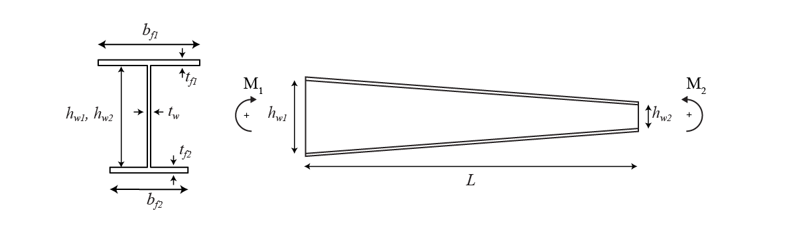

# Critical bending moment of uniform and tapered beams

The critical bending moment of beams is a limit value for which the deformation remains in the plane of the loads, where larger values cause lateral deflection and cross-section twisting. Because of this behavior, this limit state is known as lateral-torsional buckling and is used to compute the ultimate strength of beams in steel design standards.

This dataset was created using a Finite Element software (ANSYS) to develop a neural network model in the paper Couto, Carlos. "Neural network models for the critical bending moment of uniform and tapered beams." Structures. Vol. 41. Elsevier, 2022. Two files are included, one with the original training dataset and the second with the original testing dataset, containing 60549 and 8526 samples each.

In the dataset the following notation is used:

with all the dimensions in **[mm]** and M1 and M2 in **[kNm]**. **The target value y** corresponds to the critical bending moment of the beam.

NOTE: In the original paper, **the target value y** has been normalized by Mcr_u. The following python function allows to calculate the Mcr_u as a function of the input features:

    def Mcr_u(hw1,hw2,tw,bf1,tf1, bf2, tf2,L):
        #input dimensions in mm
        r=0
        h=(hw1+hw2)/2+tf1+tf2
        b=(bf1+bf2)/2
        tf=(tf1+tf2)/2

        Iz = 1 / 12 * (2 * tf * b ** 3 + (h - 2 * tf) * tw ** 3) + 0.03 * r ** 4 + 0.2146 * r ** 2 * (tw + 0.4468 * r) ** 2
        It = 2 / 3 * (b - 0.63 * tf) * tf ** 3 + 1 / 3 * (h - 2 * tf) * tw ** 3 + 2 * (tw / tf) * (0.145 + 0.1 * r / tf) * (((r + tw / 2) ** 2 + (r + tf) ** 2 - r ** 2) / (2 * r + tf)) ** 4
        Iw = tf * b ** 3 / 24 * (h - tf) ** 2
        E=210000 #MPa, because all dimensions are in mm
        C1=1.0
        C2=0.0
        C3=0.0
        kz=1.0
        kw=1.0
        zg=0.0
        zj=0.0
        PI=3.141592653589793
        mcr_u = C1 * PI ** 2 * E * Iz / (kz * L) ** 2 * (((kz / kw) ** 2 * Iw / Iz + (kz * L) ** 2 * E / (2 * (1 + 0.3)) * It / (PI ** 2 * E * Iz) + (C2 * zg - C3 * zj) ** 2) ** 0.5 - (C2 * zg - C3 * zj))
        #output in kNm
        return mcr_u*10**-6